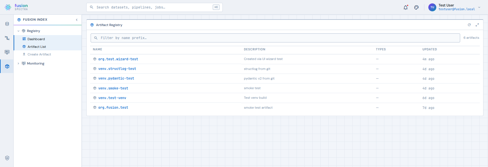
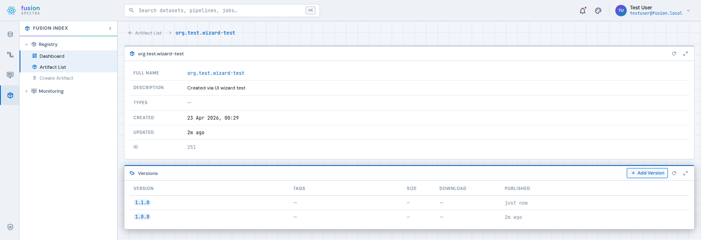
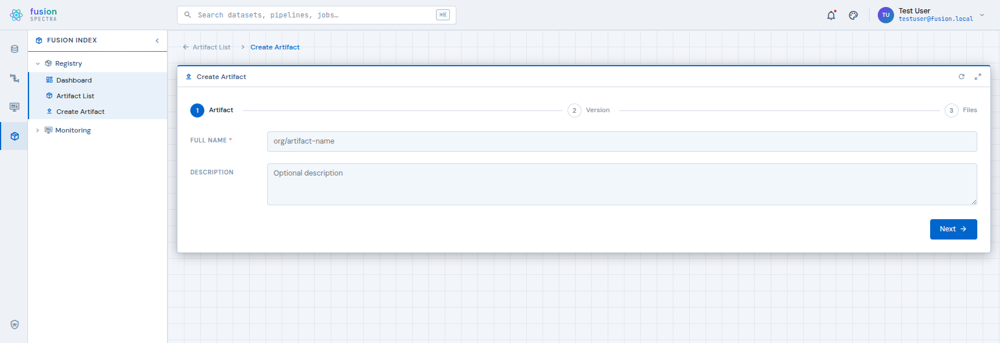
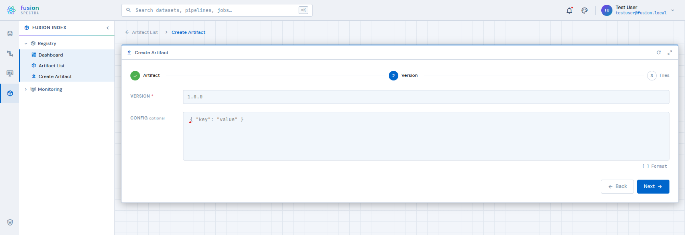
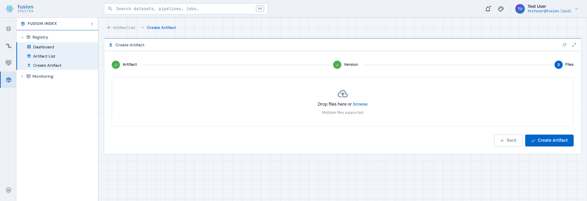
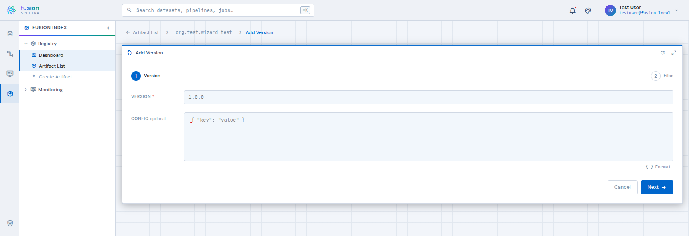

# fusion-spectra

The Fusion Platform web UI — a Vue 3 micro-frontend shell that brings together data cataloguing, pipeline management, monitoring, and the Fusion Index artifact registry in a single IDE-style interface.



---

## Features

| Context | Status | Description |
|---------|--------|-------------|
| **Data** | Placeholder | Catalog, storage, access control |
| **Pipelines & Jobs** | Placeholder | Pipeline runs, job history, templates |
| **Monitoring** | Placeholder | System health, metrics, alerts |
| **Forge** | Live | Async Python venv builder — create, list, detail + live logs |
| **Fusion Index** | Live | Artifact registry — list, create, version, tags, download, delete |
| **Admin** | Partially live | Role assignments, resource permissions, artifact types |

### Fusion Index (implemented)

- **Artifact list** — searchable, paginated registry of all artifacts
- **Artifact detail** — metadata + version history with per-file download links; inline tag management
- **Create Artifact wizard** — 3-step: name/description → semver + JSON config → multi-file upload
- **Add Version wizard** — 2-step: semver + JSON config → multi-file upload
- **Delete artifact / version** — with confirmation dialogs; last-version removal prompts artifact cleanup
- **Tags** — artifact-level named pointers to a semver (like a git tag); inline add/move/delete per version row
- **JSON config editor** — CodeMirror 6 with syntax highlighting, lint validation, and Format button

### Forge (implemented)

- **Venv list** — paginated table with multi-status chip filter and debounced name search
- **Create Venv wizard** — 2-step: package info → requirements.txt upload with live server-side validation
- **Venv detail** — metadata + live build log panel; auto-polls every 5 s while PENDING/BUILDING

### Admin (partially implemented)

- **Role Assignments** (`/admin/roles`) — manage group → role mappings backed by BFF DB
- **Resource Permissions** (`/admin/permissions`) — grant per-resource permissions to users/groups/roles
- **Artifact Types** (`/admin/types`) — CRUD for artifact type taxonomy

### RBAC

- Permission gates via `usePermission()` composable: `can('index:artifacts:delete')` / `can('perm', resourceId)`
- Resource-scoped grants: a user can hold a permission on a specific artifact/venv without a global grant
- Admin-only UI elements and routes hidden from non-admin users at the router and component level

---

## Quick start

```bash
npm install
npm run dev
# → http://dev.fusion.local:5174
```

Requires `127.0.0.1 dev.fusion.local` in `/etc/hosts`. See [INSTALL.md](INSTALL.md) for full setup.

---

## Screenshots

| | |
|---|---|
|  |  |
| Artifact Registry | Artifact Detail + Versions |
|  |  |
| Create Artifact — Step 1 | Create Artifact — Step 2 (JSON editor) |
|  |  |
| Create Artifact — Step 3 (file upload) | Add Version — Step 1 |

---

## Documentation

- [INSTALL.md](INSTALL.md) — Dev server, minikube, production Helm deployment
- [ARCHITECTURE.md](ARCHITECTURE.md) — System design, component tree, API layer, auth flow

---

## Stack

- **Vue 3** + Composition API (`<script setup>`)
- **Quasar 2** — UI components and icon set (mdi-v7)
- **Pinia** — auth and theme stores
- **Vue Router 4** — hash history, context-based routing
- **Vite 5** — build tooling (Module Federation host)
- **CodeMirror 6** — JSON editor with linting
- **TypeScript** throughout
- **7 themes** — Midnight (default), Azure, Carbon, Matrix, Synthwave, Light, Lumen
